### Images

## 1. About Page
This section shows the About page of the extension, giving users an overview of its functionality.

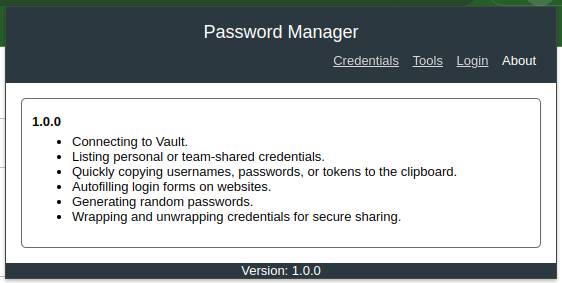

## 2. Login
This section showcases the login process, error handling, and the interface after a successful login.

### 2.1 Login Page
The login page allows users to enter the Vault URL and choose an authentication method. We recommend using **HTTPS** for security, as shown in the example. Users can authenticate using either **local Vault credentials** or **LDAP authentication**.

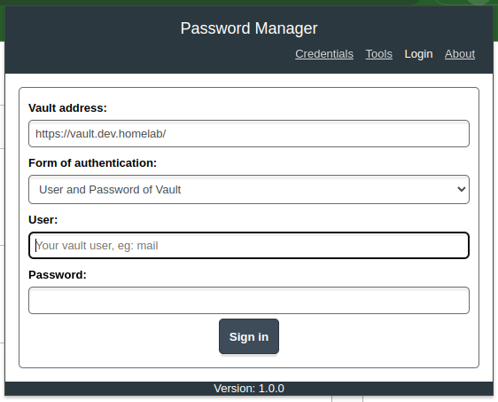

### 2.2 Error Handling
If the user does not provide all required fields or enters invalid values, the extension displays validation messages to guide them. This ensures a smoother experience by preventing common mistakes.

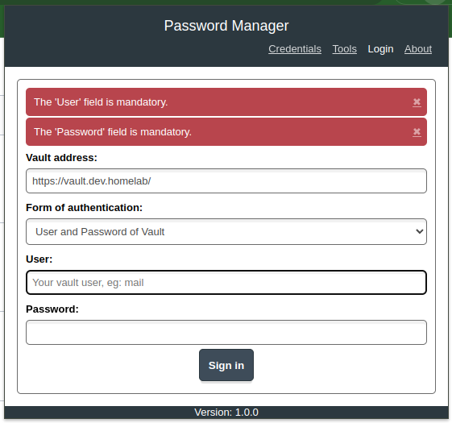

### 2.3 Signed-In State
Once logged in, the interface displays the authenticated **Vault URL** and the **user's name**, confirming a successful login. This provides users with clear feedback that they are connected to the correct Vault instance.

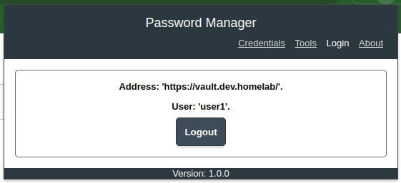

## 3. Tools
This section highlights the available tools within the extension, including the **Password Generator**, **Wrap**, and **Unwrap** functionalities.

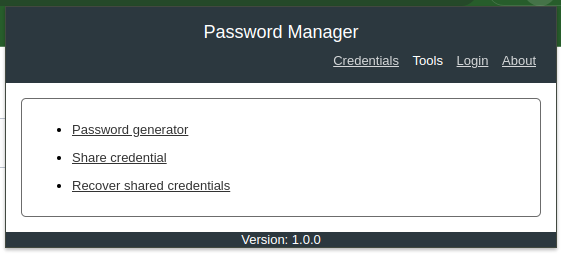

### 3.1 Password Generator
The **Password Generator** tool allows users to create secure passwords with customizable options. Users can specify:
- Inclusion of **numbers**, **lowercase letters**, **uppercase letters**, and **special characters**
- Desired **password length** (default is **20 characters**)

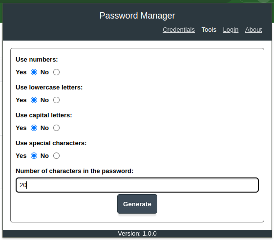

#### 3.1.1 Generated Password (Hidden)
Once a random password is generated, it is displayed as **masked characters ("****")** by default. This allows users to copy the password securely without exposing it on the screen.

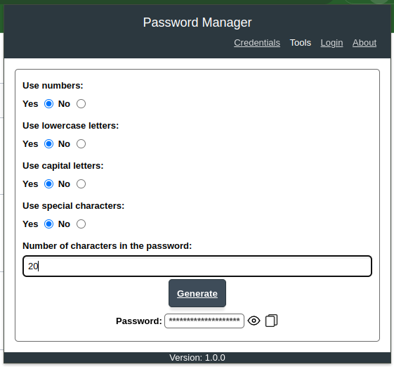

#### 3.1.2 Generated Password (Visible)
If needed, users can click the **"View"** button to reveal the generated password.

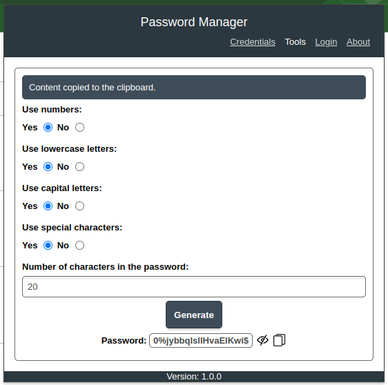

### 3.2 Wrap
The **Wrap** tool simplifies the process of creating wrapped secrets, providing both **Simple** and **Advanced** options to accommodate different user needs.

#### 3.2.1 Simple Wrap
The **Simple** tab is designed for users who may not be familiar with JSON formatting. It allows users to create a wrapped secret using a **single key-value pair**.
- Users can enter a **key** (e.g., `password`) and a **value** (e.g., `xyzabc123@`).
- The expiration time for the wrapped secret can be set, with the **default being 30 minutes**, just like in the Vault UI.

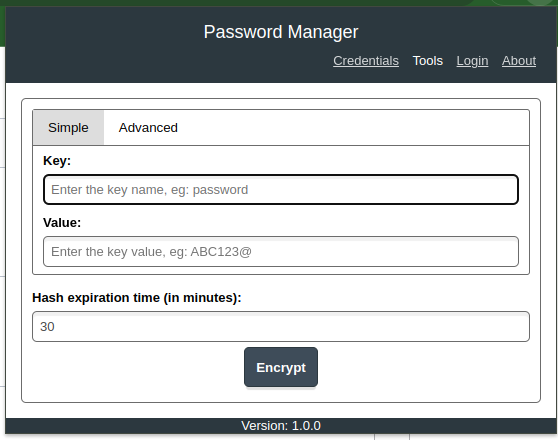

To assist users, a **sample key-value entry** is provided for reference.

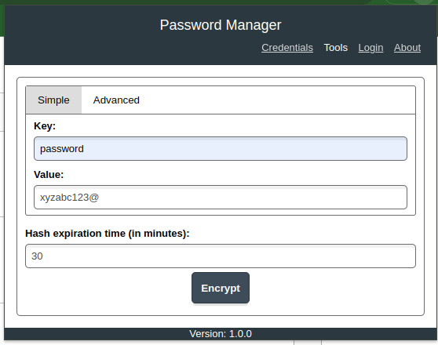

Once the secret is wrapped, Vault returns a **wrapped token (hash)**, which can be shared securely without exposing the actual value.

#### 3.2.2 Advanced Wrap
The **Advanced** tab is intended for more experienced users who need to wrap **multiple key-value pairs**.
- This tab requires a **valid JSON format**, similar to the Vault UI.
- A sample with two key-value pairs is provided to guide users in structuring their input correctly.

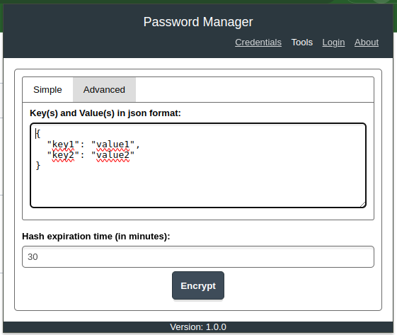

### 3.3 Unwrap
The **Unwrap** tool allows users to securely retrieve the original contents of a wrapped secret by providing a valid wrapped token (hash).

#### 3.3.1 Entering a Wrapped Token
This page is used when a user receives a **wrapped token (hash)** from someone and needs to retrieve its original content. The user simply enters the token into the provided field.

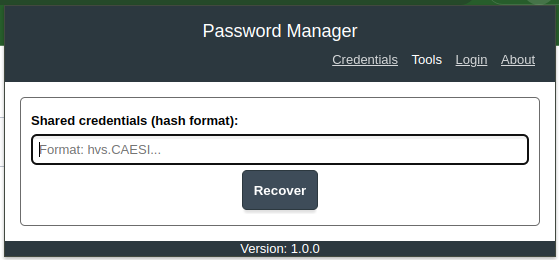

#### 3.3.2 Retrieving the Original Content
Once the user submits the wrapped token, Vault returns and displays the **original secret** that was previously wrapped.

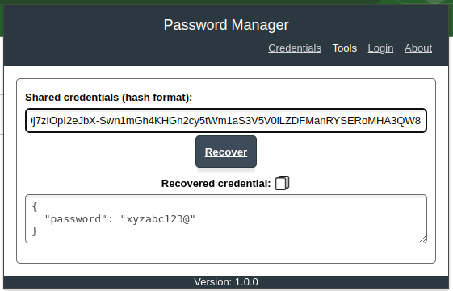

#### 3.3.3 Security: One-Time Use
For security reasons, wrapped tokens **can only be unwrapped once**. If the same token is used again, an **error message** is displayed indicating that the token was either **not found or has already been used**.

This ensures that sensitive information is **not exposed multiple times** and remains secure.

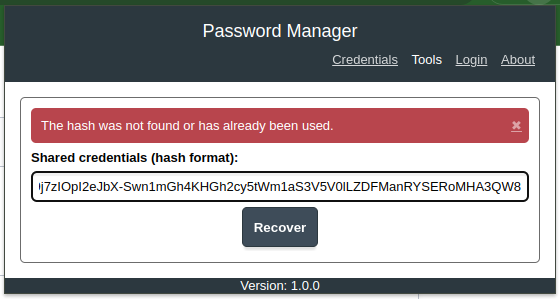

## 4. Create Credentials
This section explains how to **create and manage credentials** using the extension. Users can define various properties for their credentials, such as **secret engine, path, name, authentication type**, and **optional comments** for better organization.

Users can either **manually enter a password or token** or use the **"Random Password"** or **"Random Token"** button to generate a secure credential.

### 4.1 Defining Credential Properties
The user must provide the **secret engine, path, credential name**, and choose whether the credential will be a **username/password** or a **token**. An optional **comment field** is also available for describing the credential.

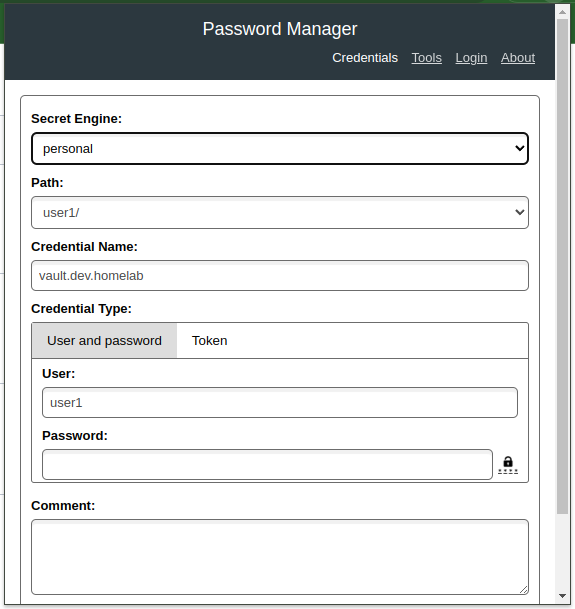

### 4.2 Selecting the Secret Engine
The first step is to choose the **secret engine** where the credential will be stored. This dropdown lists all secret engines the user has access to.

In this example, the user has access to both **personal secrets** and a **team secret** engine. Credentials stored in the **team secret engine** can be accessed and shared with all members of that team.

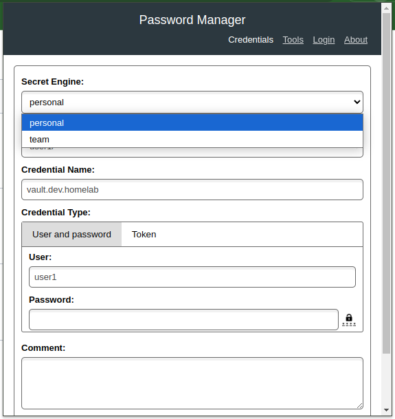

### 4.3 Organizing with Multiple Paths
Just like in Vault’s UI, users can create **structured paths** to organize credentials efficiently. For example, credentials can be stored under paths such as:
- `production/database`
- `staging/database`

This feature is particularly useful for managing **a large number of credentials** in an organized manner.

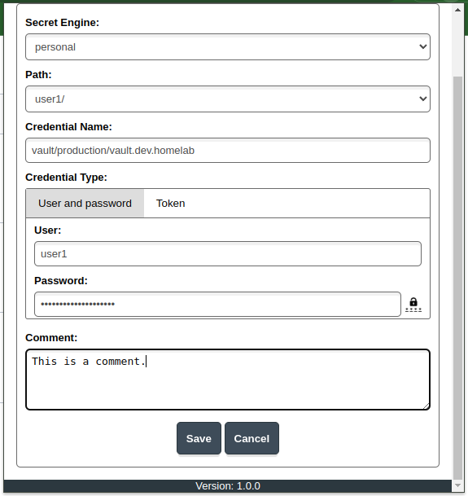

### 4.4 Creating a Token-Based Credential
If the user selects **"Token"** as the credential type, only the **Token field** is displayed.

Some credentials are **not** a combination of **username and password**, but instead just a **single token**. This option allows users to store and manage such credentials easily.

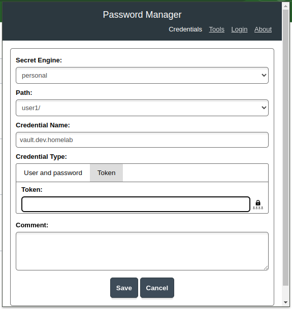

## 5. List and Delete Credentials
This section explains how to **view, search, and manage credentials**, including features like **pagination and deletion**.

### 5.1 Searching for Credentials
The extension automatically searches for credentials based on the **current website URL** when the user clicks the extension icon in the browser.

For example, if the user is on **github.com** and clicks the extension icon, the popup will **automatically search for stored credentials** related to "github.com". If any matching credentials are found, they will be displayed. Otherwise, no results will be shown.

Users can also **manually enter a search term** to find credentials.

Each credential entry provides action buttons:
- **Copy Username** (if applicable)
- **Copy Password** (if applicable)
- **Copy Token** (for token-based credentials)
- **Edit Credential**
- **Delete Credential**

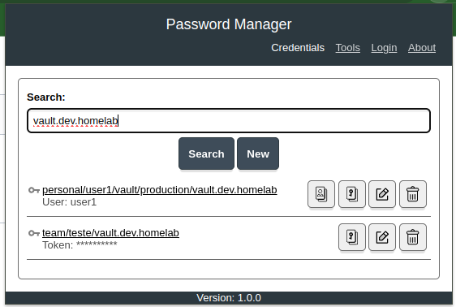

### 5.2 Integration with Vault UI Credentials

If you're using **HashiCorp Vault** to store secrets and credentials, credentials created through the Vault UI can also be listed by the extension. However, there are some requirements to ensure proper integration.

#### Field Name Mapping
In order for the extension to recognize and display Vault UI credentials correctly, the field names must align with one of the following mappings:
- **Username Keys**:

  `"user", "usuario", "username", "user_name", "login", "cpf", "email"`

- **Password Keys**:

  `"pass", "senha", "password", "secret"`

- **Token Keys**:

  `"token", "key", "chave"`

- **Comment Keys**:

  `"comment", "comments", "comentario", "comentarios", "comentário", "comentários"`

Ensure that the stored credentials in Vault follow these naming conventions for seamless listing and management within the extension.

### 5.3 Pagination for Large Credential Lists
If the list contains **more than four credentials**, a **pagination bar** appears, allowing users to navigate through the results easily.

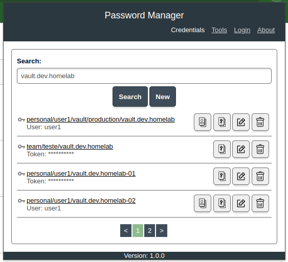

### 5.4 Deleting a Credential
Each credential entry includes a **Delete button**. When clicked, a **confirmation popup** appears asking if the user is sure about deleting the credential.

If the user confirms, the credential is **permanently deleted from Vault**.

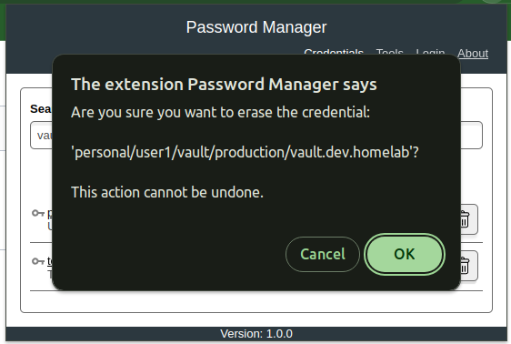

## 6 Personal Credential Details
Using the Vault UI, you can view credential details, with the option to hide or show secret values. It's important to note that the password is securely stored in an encrypted format within Vault, ensuring its protection even when viewed in the UI.

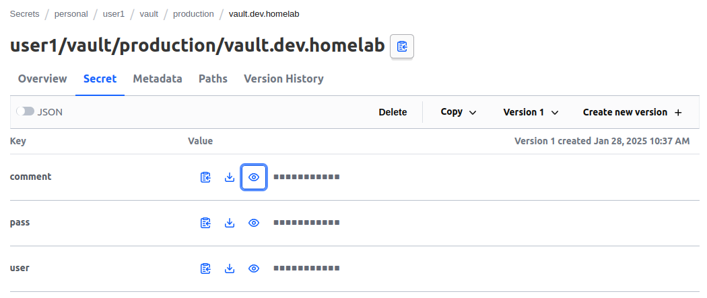
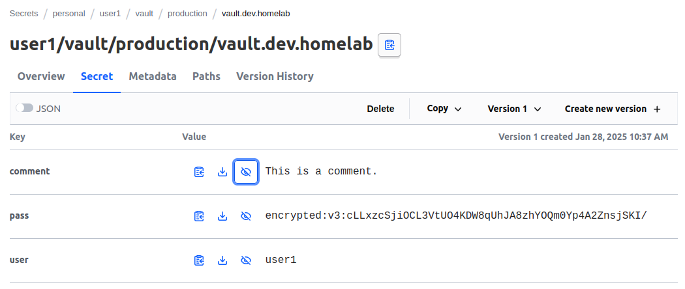

[Go Back.](../README.md)
