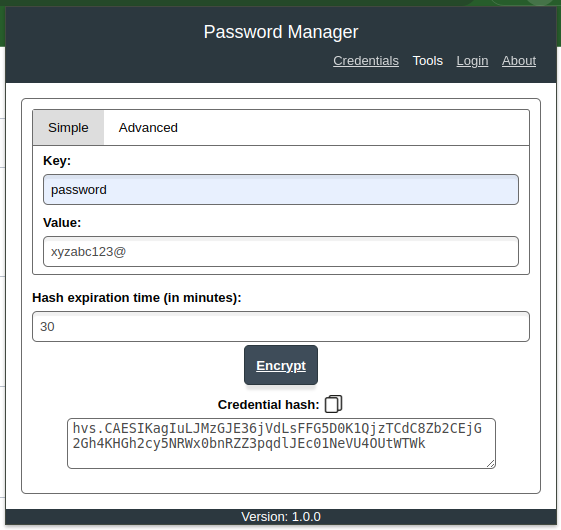

### Images

## 1. About Page
This section shows the About page of the extension, giving users an overview of its functionality.

## 2. Login
This section showcases the login process, error handling, and the interface after a successful login.

### 2.1 Login Page
The login page allows users to enter the Vault URL and choose an authentication method. We recommend using **HTTPS** for security, as shown in the example. Users can authenticate using either **local Vault credentials** or **LDAP authentication**.

### 2.2 Error Handling
If the user does not provide all required fields or enters invalid values, the extension displays validation messages to guide them. This ensures a smoother experience by preventing common mistakes.

### 2.3 Signed-In State
Once logged in, the interface displays the authenticated **Vault URL** and the **user's name**, confirming a successful login. This provides users with clear feedback that they are connected to the correct Vault instance.

## 3. Tools
This section highlights the available tools within the extension, including the **Password Generator**, **Wrap**, and **Unwrap** functionalities.

### 3.1 Password Generator
The **Password Generator** tool allows users to create secure passwords with customizable options. Users can specify:
- Inclusion of **numbers**, **lowercase letters**, **uppercase letters**, and **special characters**
- Desired **password length** (default is **20 characters**)

#### 3.1.1 Generated Password (Hidden)
Once a random password is generated, it is displayed as **masked characters ("****")** by default. This allows users to copy the password securely without exposing it on the screen.

#### 3.1.2 Generated Password (Visible)
If needed, users can click the **"View"** button to reveal the generated password.

### 3.2 Wrap
The Wrap tool simplifies the process of creating wrapped secrets, offering both simple and advanced options.

### 3.3 Unwrap
The Unwrap tool allows users to securely retrieve the contents of a wrapped secret.

## 4. Create Credentials
This section shows how to create and manage credentials using the extension.

### 4.1 List and Delete Credentials
View and manage your credentials, including pagination and deletion features.

### 4.2 Personal Credential Details
Using the Vault UI, you can view credential details, with the option to hide or show secret values. It's important to note that the password is securely stored in an encrypted format within Vault, ensuring its protection even when viewed in the UI.

[Go Back.](../README.md)
